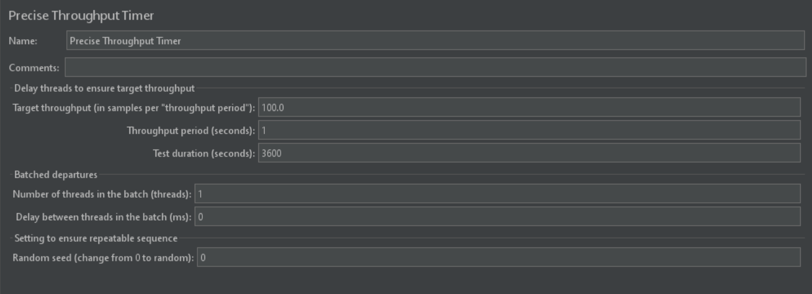
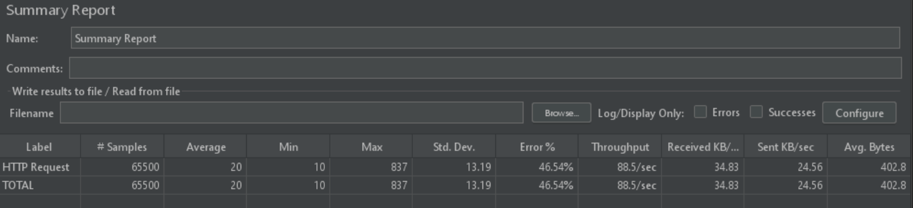
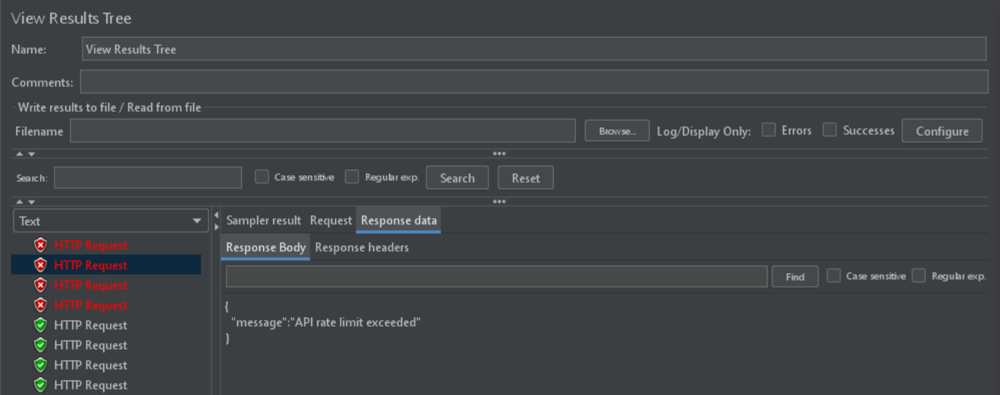
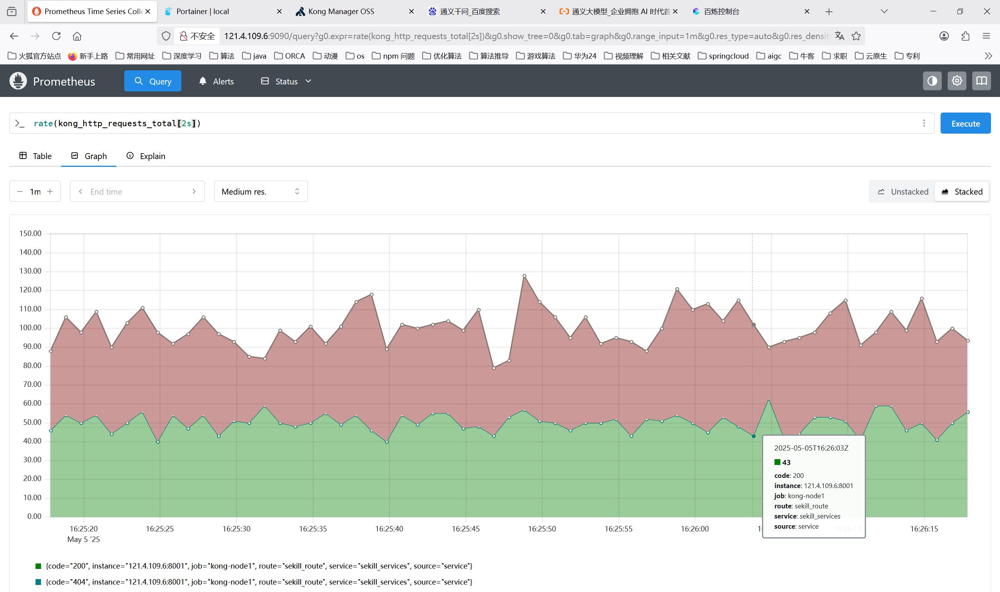

# 方案一
## 限流方式
kong+ratelimit插件
基于redis本地窗口算法限流（kong 社区版只提供了固定窗口算法限流）

# 压测
## 测试平台
2核4G 腾讯云轻量级服务器

### jmeter压测
目标频率每秒请求100次（当前机器极限）

可以看到部分请求被限流

### 普罗米修斯监控

由于监控精度在2s区间范围因此通过请求的数量在50范围内波动
### 优化方向
自定义插件实现滑动窗口算法

### 快速开始

docker-compose up -d

### 接口转发

#### 服务转发
curl -i -X POST http://网关ip:kong网关8001对应端口/services \
  --data name=服务名称 \
  --data url=http://服务ip:8081

#### 接口路由
curl -i -X POST http://网关ip:kong网关8001对外端口/services/服务名称/routes \
  --data name=服务接口路由 \
  --data paths[]=/ \
  --data strip_path=false

#### 测试转发服务
curl --location --request POST 'http://网关ip:kong网关客户端8000对应端口/服务接口路由' \
--header 'Host: 服务名-api.example.com' \
--header 'Content-Type: application/json' \
--data '{
    测试数据
}'
### 配置限流

#### 本地滑动窗口
curl -i -X POST http://网关ip:kong网关8001对外端口/routes/路由名称/plugins \
  --data name=rate-limiting \
  --data config.second=每秒限流次数 \
  --data config.policy=local

#### redis固定窗口
curl -i -X POST http://网关ip:kong网关8001对外端口/routes/路由名称/plugins \
  --data name=rate-limiting \
  --data config.second=每秒限流次数 \
  --data config.policy=redis \
  --data config.redis_host=redisIP \
  --data config.redis_port=redisPort

### 线上部署访问
kong面板 http://121.4.109.6:8002
portainer面板 http://121.4.109.6:9000
prometheus面板 http://121.4.109.6:9090

可用测试限流脚本：
for i in {1..400}; do
  curl -s -o /dev/null -w "%{http_code}\n" \
    --location --request POST 'http://121.4.109.6:8000/seckill/get' \
    --header 'Host: seckill-api.example.com' \
    --header 'Content-Type: application/json' \
    --data-raw '{
        "order": {
            "create_time": ""
        },
        "user_id": 1,
        "limit": 1
    }' &
done
wait

# 方案二

## 限流方式
基于redis滑动窗口算法限流

算法：每次请求时向redis zset添加一个成员，成员为雪花算法生成的唯一ID，score为时间，将窗口外的成员删除后，再查询zset成员数量是否达到限流数量，达到限流数量返回false（代表被限流）否则返回true,以上两个操作基于lua脚本保证一致性。

### 线上测试接口
dVuT001 在 Apifox 邀请你加入团队 基础接口限流网关 https://app.apifox.com/invite?token=8LaGzuliiy_dmsWxkb6h-