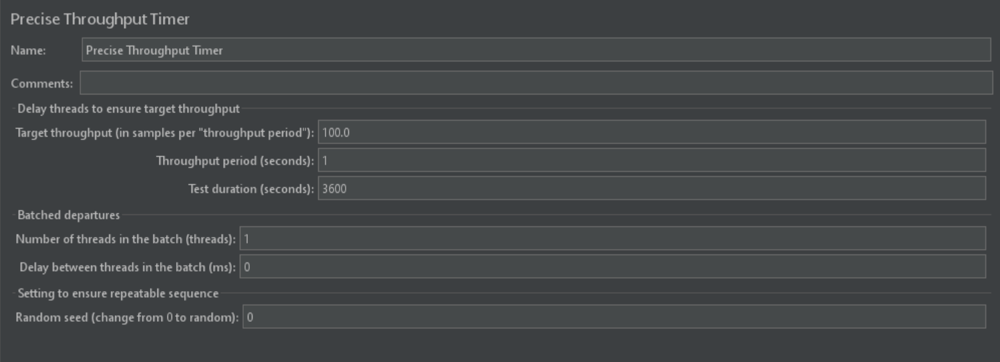
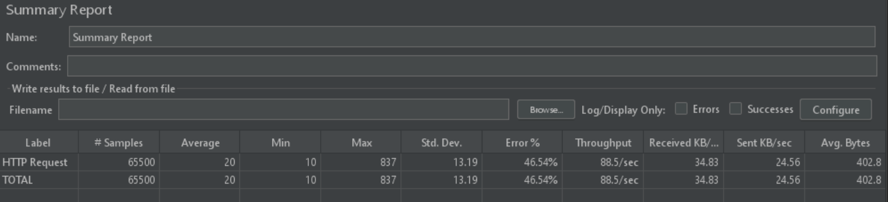
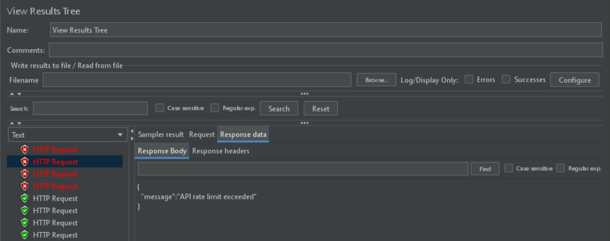
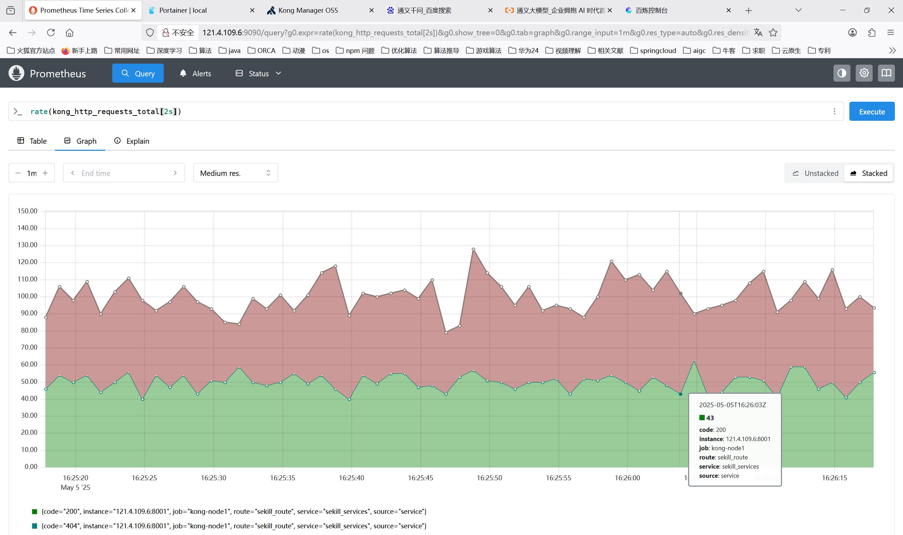

# 方案一
./docker-compose
## 限流方式
kong+ratelimit插件
基于redis本地窗口算法限流（kong 社区版只提供了固定窗口算法限流）

# 压测
## 测试平台
2核4G 腾讯云轻量级服务器

### jmeter压测
目标频率每秒请求100次（当前机器极限）

可以看到部分请求被限流

### 普罗米修斯监控

由于监控精度在2s区间范围因此通过请求的数量在50范围内波动
### 优化方向
自定义插件实现滑动窗口算法

### 快速开始

docker-compose up -d

### 接口转发

#### 服务转发
curl -i -X POST http://网关ip:kong网关8001对应端口/services \
  --data name=服务名称 \
  --data url=http://服务ip:8081

#### 接口路由
curl -i -X POST http://网关ip:kong网关8001对外端口/services/服务名称/routes \
  --data name=服务接口路由 \
  --data paths[]=/ \
  --data strip_path=false

#### 测试转发服务
curl --location --request POST 'http://网关ip:kong网关客户端8000对应端口/服务接口路由' \
--header 'Host: 服务名-api.example.com' \
--header 'Content-Type: application/json' \
--data '{
    测试数据
}'
### 配置限流

#### 本地滑动窗口
curl -i -X POST http://网关ip:kong网关8001对外端口/routes/路由名称/plugins \
  --data name=rate-limiting \
  --data config.second=每秒限流次数 \
  --data config.policy=local

#### redis固定窗口
curl -i -X POST http://网关ip:kong网关8001对外端口/routes/路由名称/plugins \
  --data name=rate-limiting \
  --data config.second=每秒限流次数 \
  --data config.policy=redis \
  --data config.redis_host=redisIP \
  --data config.redis_port=redisPort

### 线上部署访问
kong面板 http://121.4.109.6:8002

portainer面板 http://121.4.109.6:9000

prometheus面板 http://121.4.109.6:9090
查看流量命令

1）rate(kong_http_requests_total[2s]) 

2）rate(kong_http_requests_total{code="200"}[2s])

可用测试限流脚本：
for i in {1..400}; do
  curl -s -o /dev/null -w "%{http_code}\n" \
    --location --request POST 'http://121.4.109.6:8000/seckill/get' \
    --header 'Host: seckill-api.example.com' \
    --header 'Content-Type: application/json' \
    --data-raw '{
        "order": {
            "create_time": ""
        },
        "user_id": 1,
        "limit": 1
    }' &
done
wait

### 优势
高性能分布式支持：Redis 作为内存数据库，具有超高的性能，尤其适合高并发场景。对于多节点分布式环境，Redis 可以轻松同步和共享限流状态。

集成简便：在 Kong 中启用 Redis 支持的限流插件，只需要简单配置即可，无需自行实现复杂的限流逻辑。

强大的限流策略支持：Redis 支持多种限流策略，如令牌桶（Token Bucket）、漏桶（Leaky Bucket）等，提供更多选择。

高可用性：通过配置 Redis Sentinel 或 Redis Cluster，可以实现 Redis 服务的高可用性和故障恢复。

### 劣势
额外的外部依赖：需要维护一个 Redis 集群，并确保 Redis 的高可用性。如果 Redis 出现故障或连接问题，可能会导致限流失效。

复杂性增加：配置 Redis 和维护 Redis 集群增加了系统的复杂性，需要额外的资源和运维工作，特别是在大规模部署时。

延迟可能较高：尽管 Redis 性能非常高，但在极高并发的情况下，跨网络调用 Redis 可能引入额外的延迟，特别是在多数据中心部署的情况下。

# 方案二
./slip window
## 限流方式
基于redis滑动窗口算法限流

算法：每次请求时向redis zset添加一个成员，成员为雪花算法生成的唯一ID，score为时间，将窗口外的成员删除后，再查询zset成员数量是否达到限流数量，达到限流数量返回false（代表被限流）否则返回true,以上两个操作基于lua脚本保证一致性。

### 线上测试接口
dVuT001 在 Apifox 邀请你加入团队 基础接口限流网关 https://app.apifox.com/invite?token=8LaGzuliiy_dmsWxkb6h-

### 优势
高度灵活性：可以完全根据业务需求自定义限流策略（如令牌桶、漏桶、计数器等），并根据 Redis 的能力灵活调整。

分布式支持：Redis 自带分布式特性，可以轻松实现多节点、跨地域的限流。

性能和扩展性：Redis 作为内存数据库，具有极高的读写性能，适合高并发、大规模系统。

### 劣势
不集成 API 管理：与 Kong 集成的方案相比，单独的 Redis 限流方案缺乏 API 管理、监控、分析等功能，需要额外实现。

# 优化方向
1、单节点有限且容易发生故障，需要多节点集群部署，实现高可用

2、固定窗口可能会导致短时流量过大，需要实现自定义滑动窗口算法插件